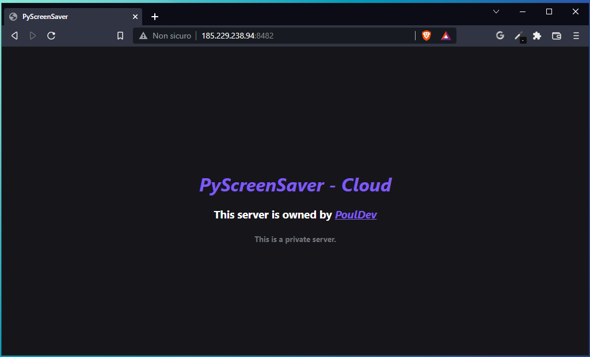
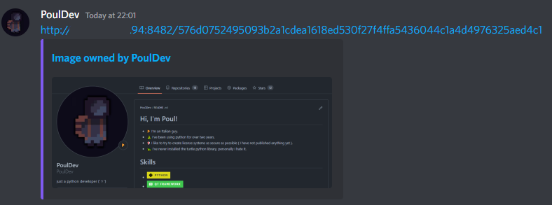
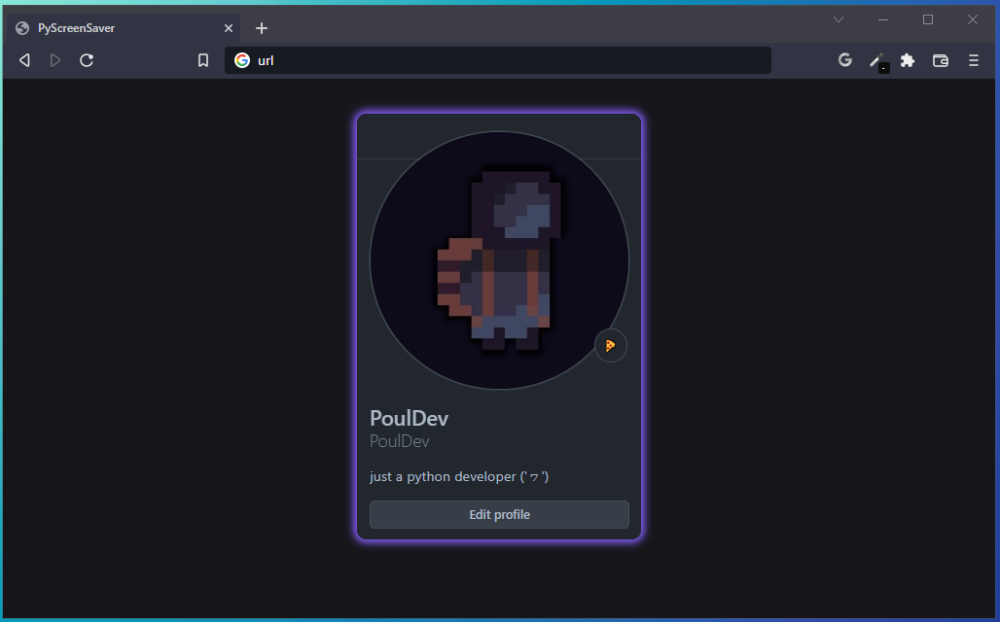

# PyScreenSaver
#### A simple program to select and copy an area of the screen using a customizable shortcut
#### Note: the screenshot will be copied in your clipboard

<br>

## Sections:
- [Some Screenshots](https://github.com/PoulDev/PyScreenSaver#some-screenshots)
- [Run in background](https://github.com/PoulDev/PyScreenSaver#run-in-background)
- [Server Configuration](https://github.com/PoulDev/PyScreenSaver#server-configuration)
- [Client Configuration](https://github.com/PoulDev/PyScreenSaver#client-configuration)

> ## Some Screenshots
> #### Website Home
> 
> #### Discord Embed
> 
> #### Image Webpage
> 

> ## Run in background:
>   ```
>   pythonw main.py
>   ```

> ## Server Configuration:
> If you want to use a personal server you need to configure it.
> 
> - First of all you have to set a password, which we will then set in the settings of the client, to do so just open configs.json in the server folder and change the value "password" in the category "auth"
> - Then you can set aesthetic values such as username, redirect_link and anonymous. Or even the maximum number of images to save, the host port and the color of the Discord embed

> ## Client Configuration
> At this point you will have to set the client to use the personal server, after loading the server folder with the [configuration executed previously](https://github.com/PoulDev/PyScreenSaver#server-configuration) we open the configs.json file in the "data" folder and modify some values.
> - The first value to set is "use_server", which will have to be set to true
> - The second value is "server_password", and you have to enter the chosen password in the server configuration
> - The last important value to change is "server_ip", where you have to put the ip of your server.